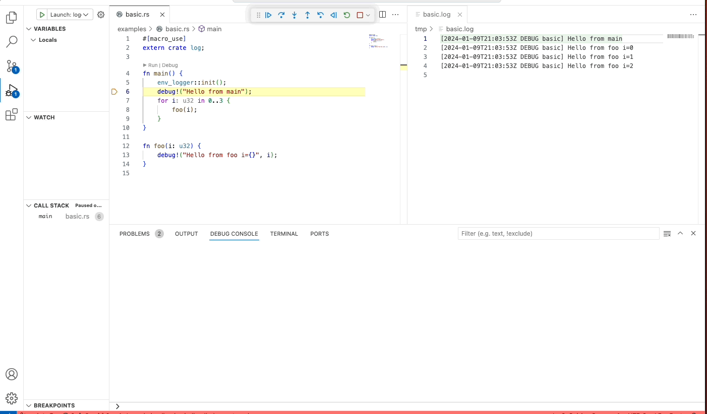

# log2src

Mapping logs to source code to augment debugging, analysis, and understanding.
## Log driven debugging

Use logs generated by your application to drive a debugger and step through the source code.
### Demo

<details>
  <summary>Click to view a GIF that demonstrates the idea.</summary>
  <p>
    
  </p>
</details>
### (Aspirational) Use cases
The current version is still an early prototype that only works with programs as simple as what is included in the examples of this project. That being said, here are some of the types of use cases that this project hopes to improve over a traditional debugger.
1. Multi-threaded code: a connected debugger can impact the execution of multi-threaded code. Instead of connecting to your application and praying for the correct interleaving,  capture the issue in your  logs and replay as many times as you like.
2. Client server or machine-to-machine requests: stepping across multiple processes, perhaps on separate machines, requires orchestrating multiple debuggers and racing against client time outs. Alternatively aggregate logs of all machines involved and debug at your own pace. The service logs need not be implemented in the same programming language for this functionality.
3. Production issues: trying to debug on prod is risky and requires access to the infrastructure where the application is running. With log2src, as long as the logs are accessible to you you can debug the problem at your own pace without impacting production servers.

### Features
- The project can map a single log file to a single source file to aid debugging and ease cognitive burden. The log and source are statically configured at start up.
- Provides the value of variables that appear in the log statements.
- Infers the call stack when possible based on an analysis of the source code.
- A limited version of the Rust source mappings is the only programming language implemented thus far.
- A VS Code extension implementing the debug adapter protocol is implemented.
### Build
You must compile the command line tool using Rust in order to install. The log2src command line tool has several options and the API is still quite experimental, so expect changes. See `-h` for the up to date documentation.

You can also build and run the VS Code extension by building the log2src binary and copying it into `editors/code/bin`. The easiest way to run the extension at the moment is from VS Code using the standard run configuration.

```
{
	"version": "0.2.0",
	"configurations": [
		{
			"name": "Run Extension",
			"type": "extensionHost",
			"request": "launch",
			"args": [
				"--extensionDevelopmentPath=${workspaceFolder}/editors/code"
			],
			"outFiles": [
				"${workspaceFolder}/editors/code/out/**/*.js"
			],
			"preLaunchTask": "${defaultBuildTask}"
		}
	]
}
```

When the new window with the extension is loaded, then load up in text editors the source code you'd like to debug as well as a log file generated from the source. See the demo above for an example.

You can run the log2src debugger using this example configuration that shows how to "debug" the `basic.rs` example. Note that the log location was stored on disk at `/tmp/basic.log`.
```
{
    "version": "0.2.0",
    "configurations": [
        {
            "type": "logdbg",
            "request": "launch",
            "name": "Launch: logdbg: stack",
            "source": "${workspaceFolder}/examples/basic.rs",
            "log": "/tmp/basic.log"
        }
    ]
}
```

## Contributing
This is mostly a hobby project done during nights and weekends at the moment, so to minimize project management I'm not looking for pull requests at the moment. Feel free to file an issue to discuss bugs, ideas, or other interest in the project.
