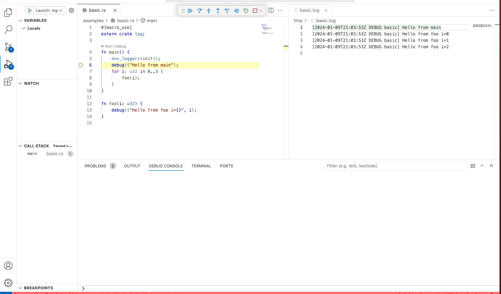

# log2src

Mapping logs to source code to augment debugging, analysis, and understanding.
## Log driven debugging

Use logs generated by your application to drive a debugger and step through the source code.
### Demo

<details>
  <summary>Click to view a GIF that demonstrates the idea.</summary>
  <p>
    
  </p>
</details>

### Use cases (Aspirational)
The following use cases motivate the project's direction, which I hope to improve over a traditional debugger:
1. Multi-threaded code: A connected debugger can impact the execution of multi-threaded code. Instead of connecting to your application and praying for the correct interleaving,  capture the issue in your  logs and replay as many times as you like.
2. Client server or machine-to-machine requests: Stepping across multiple processes, perhaps on separate machines, requires orchestrating multiple debuggers and racing against client time outs. Alternatively one could aggregate logs of all machines involved and debug at one's own pace. The client and server logs do not need to be implemented in the same programming language for this kind of functionality.
3. Production issues: Trying to debug on prod is risky and requires access to the infrastructure where the application is running. With log2src, as long as the logs are accessible to you, you can debug the problem offline without impacting production servers.

### Features
- Maps log lines back onto the source code to aid debugging by easing cognitive burden.
- Tries to reconstruct a portion of the program state by providing values of expressions & variables.
- Infer the call stack when possible based on an analysis of the source code.
- Rust, Java, C++, and Python are currently supported.
- A VS Code extension using the debug adapter protocol.

### Build

[](https://github.com/ttiimm/log2src/actions/workflows/main.yml)

You must compile the command line tool using Rust. The log2src command line tool has several options and the API is still quite experimental, so expect changes. See `-h` for the up to date documentation.

You can also build and run the VS Code extension by building the log2src binary and copying it into `editors/code/bin`. The easiest way to run the extension at the moment is from VS Code using the standard run configuration.

```
{
    "version": "0.2.0",
    "configurations": [
        {
            "name": "Run Extension",
            "type": "extensionHost",
            "request": "launch",
            "args": [
                "--extensionDevelopmentPath=${workspaceFolder}/editors/code"
            ],
            "outFiles": [
                "${workspaceFolder}/editors/code/out/**/*.js"
            ],
            "preLaunchTask": "${defaultBuildTask}"
        }
    ]
}
```

When the new window with the extension is loaded, you can load up in text editors the source code that you'd like to debug, as well as a log file generated from the source. See the demo above for an example.

You can run the log2src debugger using this example configuration that shows how to "debug" the `basic.rs` example. Note that the log location was stored on disk at `/tmp/basic.log`.
```
{
    "version": "0.2.0",
    "configurations": [
        {
            "type": "log2src",
            "request": "launch",
            "name": "Launch: log2src: stack",
            "source": "${workspaceFolder}/examples/basic.rs",
            "log": "/tmp/basic.log"
        }
    ]
}
```

In order to package the VS Code extension, run

```
$ pnpm vsce package --no-dependencies
```

The vsix package can be installed within the VS Code extensions.

## Library Usage

The `log2src` crate can be used as a library. Full API documentation is available at [docs.rs/log2src](https://docs.rs/log2src).

```rust
use log2src::{LogMatcher, LogRefBuilder};
use std::path::Path;

let mut matcher = LogMatcher::new();
matcher.add_root(Path::new("./src")).unwrap();
matcher.discover_sources();
matcher.extract_log_statements();

let log_ref = LogRefBuilder::new()
    .with_body(Some("hello from logs"))
    .build("hello from logs");
let mapping = matcher.match_log_statement(&log_ref);
if let Some(mapping) = matcher.match_log_statement(&log_ref) {
    if let Some(src_ref) = &mapping.src_ref {
        println!("{}:{} - {}", src_ref.source_path, src_ref.line_no, src_ref.text);
    }
    for var in &mapping.variables {
        println!("  {} = {}", var.expr, var.value);
    }
}
```

## Contributing
This is mostly a hobby project worked on during nights and weekends, so to minimize project management I'm not looking for pull requests at the moment. Feel free to file an issue to discuss bugs, ideas, or other interest in the project.
